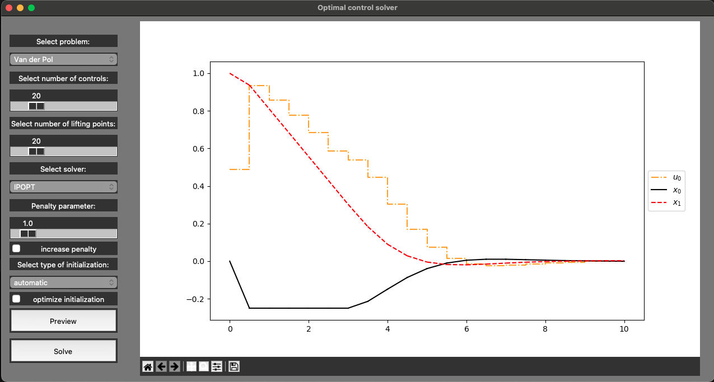

# Python software for Strategies and Heuristics Regarding Lifting of Optimal Control problems (PySHeRLOC)
This software implements the benchmarks and algorithms described in [1].
## Getting started
First, create a new virtual python environment, e.g.,
```
python -m venv .venv
```
Then activate the virtual environment and install the necessary packages via:
```
source .venv/bin/activate
python -m pip install -r requirements.txt
```

Now you can start the solver with user interface by running 
```
python GUI.py   # for the normal optimal control problems
python OED_GUI.py   # for OED problems
```
from the same folder as the file itself.

To benchmark all problems listed in `benchmark_problems.txt`, run:
```
bash run_all_alg_benchmarks.sh   # to benchmark all algorithms
bash run_all_def_benchmarks.sh   # to benchmark all shooting discretizations
```

Alternatively, you can run the corresponding benchmark with the desire arguments, e.g.,
```
# benchmarks the Bioreactor problem using the exact Hessian variant of blockSQP2
python benchmark_def.py -n "Bioreactor" -hess y -solver blockSQP2

# benchmarks the automatic condensing algorithm for Lotka OED using the Quasi-Newton variant of blockSQP2 
python benchmark_def.py -n "Lotka OED" -hess n -fs n -cond y
```




The problem titles refer to the description on [mintOC](mintoc.de). They can be solved using IPOPT, blockSQP, blockSQP2, or fatrop.
Benchmark problems can be found inside the `Apps` folder. Those include, among many others:
<table>
    <tr>
        <td>
            Bioreactor
        </td>
        <td>
            Bioreactor Mayer
        </td>
        <td>
            Bryson Denham
        </td>
        <td>
            Bryson Denham Mayer
        </td>
    </tr>
    <tr>
        <td>
            Cart Pendulum
        </td>
        <td>
            Cart Pendulum Mayer
        </td>
        <td>
            Catalyst Mixing
        </td>
        <td>
            Cushioned Oscillation Mayer
        </td>
    </tr>
    <tr>
        <td>
            Dielectrophoretic Particle Mayer
        </td>
        <td>
            Double Oscillator
        </td>
        <td>
            Double Oscillator Mayer
        </td>
        <td>
            Ducted Fan
        </td>
    </tr>
    <tr>
        <td>
            Egerstedt
        </td>
        <td>
            Egerstedt Mayer
        </td>
        <td>
            Electric Car
        </td>
        <td>
            Electric Car Mayer
        </td>
    </tr>
    <tr>
        <td>
            Fuller
        </td>
        <td>
            Fuller Mayer
        </td>
        <td>
            Hang Glider
        </td>
        <td>
            Hanging Chain
        </td>
    </tr>
    <tr>
        <td>
            Lotka Competitive
        </td>
        <td>
            Lotka Competitive Mayer
        </td>
        <td>
            Lotka Shared
        </td>
        <td>
            Lotka Shared Mayer
        </td>
    </tr>
    <tr>
        <td>
            Lotka Volterra
        </td>
        <td>
            Lotka Volterra Mayer
        </td>
        <td>
            LQR
        </td>
        <td>
            Moon Landing
        </td>
    </tr>
    <tr>
        <td>
            Mountain Car Mayer
        </td>
        <td>
            Ocean
        </td>
        <td>
            Quadrotor
        </td>
        <td>
            Rao Mease
        </td>
    </tr>
    <tr>
        <td>
            Three Tank
        </td>
        <td>
            Three Tank Mayer
        </td>
        <td>
            Van der Pol
        </td>
        <td>
            Van der Pol Mayer
        </td>
    </tr>
    <tr>
        <td>
            Lotka OED
        </td>
        <td>
            Dielectr Particle OED
        </td>
        <td>
            Jackson OED
        </td>
        <td>
            Van der Pol OED
        </td>
    </tr>
</table>


## Using the new BlockSQP
To use the new version of BlockSQP instead of the one included in CasADi, you have to change the path inside the file `blocksqp_path.txt`:
```
# path to your local installation of BlockSQP 2:
{PATH_TO_LOCAL_INSTALLATION}/blockSQP2/Python
```

## Using the CasADi BlockSQP
To use the CasADi version of BlockSQP, you have to configure the [ma27 solver](https://www.hsl.rl.ac.uk/ipopt/).

[1]: [Lampel, R., Sager, S.: "On lifting strategies for optimal control problems"]
